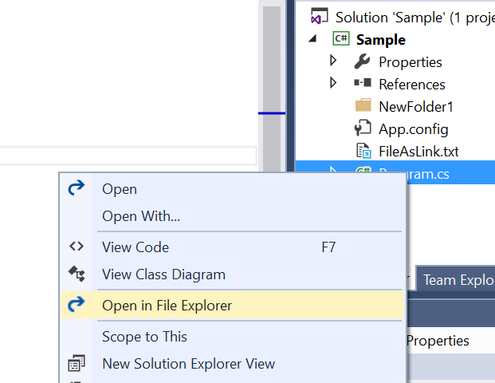
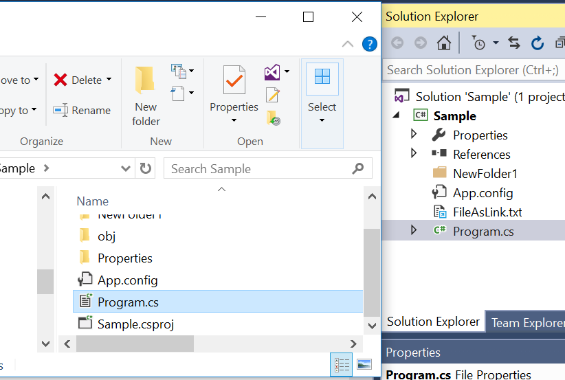

# LocateFolder

<!-- Update the VS Gallery link after you upload the VSIX-->
Download this extension from the [VS Gallery](http://vsixgallery.com/extension/106f5189-471d-40ab-9de2-687c0a3d98e4/)
or get the [CI build](http://vsixgallery.com/extension/106f5189-471d-40ab-9de2-687c0a3d98e4/).

---------------------------------------

Helps to locate files and folder in windows explorer. 

See the [change log](CHANGELOG.md) for changes and road map.

## Features

- Open the selected file in windows explorer

### Locate files in windows explorer
Select a file or multiple files and right click.

Then click on Open in File Explorer, the selected file will be openend in windows file explorer.

For the selected linked files, respective containing folders will be opened in windows file explorer.

## Contribute
Check out the [contribution guidelines](CONTRIBUTING.md)
if you want to contribute to this project.

For cloning and building this project yourself, make sure
to install the
[Extensibility Tools 2015](https://visualstudiogallery.msdn.microsoft.com/ab39a092-1343-46e2-b0f1-6a3f91155aa6)
extension for Visual Studio which enables some features
used by this project.

## License
[Apache 2.0](LICENSE)